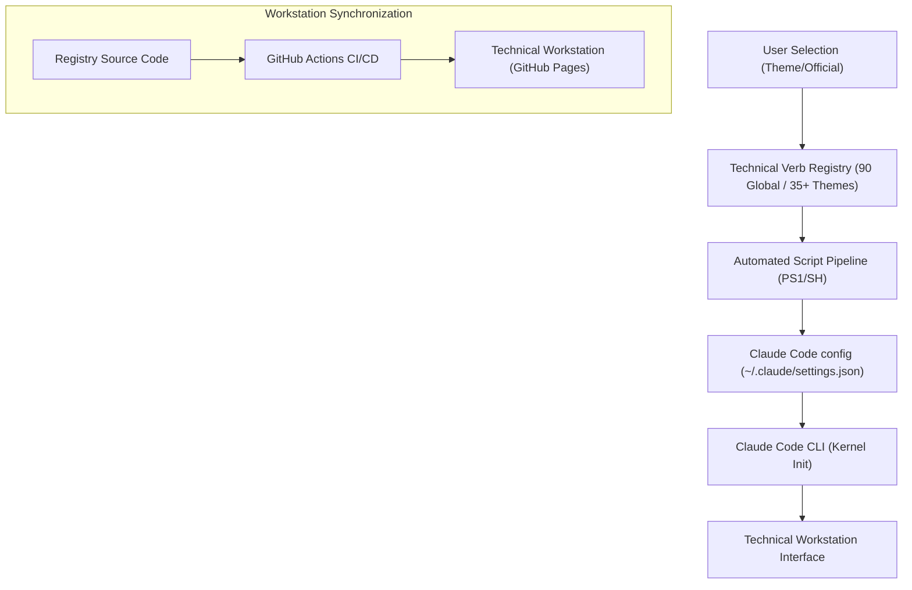

# Technical Specification: Claude Spinner Words

## Architectural Overview

**Claude Spinner Words** is an autonomous technical registry and configuration workstation designed for the Claude Code CLI environment. The architecture provides precise control over the asynchronous state indicators (verbs) used during processing, enabling sovereign customization and systematic verification of the terminal experience. It integrates a professional-grade workstation with a zero-dependency automation pipeline for deterministic configuration management across **35+ specialized thematic indices**.

### Structural Data Flow

---

## Technical Implementations

### 1. Thematic Engine Architecture
-   **Modular JSON Registries**: The project utilizes a decentralized thematic engine where over **35+ specialized collections** (Marvel, Disney, Friends, Gen-Z, etc.) are stored as structured JSON objects. This allows for scalable community contributions and precise technical auditing.
-   **Zero-Dependency Logic**: The workstation and automation scripts are written in pure Vanilla JavaScript (ES6+) and native Multi-Platform Shell (PowerShell v5.1+ / Bash v4.0+), requiring no external package managers for production deployment.

### 2. Logic & Synchronization
-   **Asynchronous Typewriter Engine**: Features a surgical feedback loop in the workstation that simulates real-time CLI verb cadence. It utilizes a stochastic "shimmer" delay to mimic realistic compute-latency during state transitions.
-   **Verified State Registry**: Maintains a canonical index of all **90 production-grade verbs** audit-trailed directly from the Claude Code binary. This serves as the authoritative ground-truth for all thematic extensions.
-   **Authentic Boot Loader**: Integrates a preliminary terminal loading sequence that synchronizes with the kernel initialization of the workstation, providing a seamless technical experience.

### 3. Configuration Workstation
-   **Global Workstation UI Matrix**: The interface leverages hardware-accelerated CSS3 Grid/Flexbox layouts with fluid typography. The viewport is locked to a non-scrollable `100vh` canvas for peak workstation stability and visual parity with the Claude CLI.
-   **Interactive Console Identity**: The workstation automatically initializes a developer-branded signature within the browser's technical console, duplicating the production-standard identity audit.

### 4. Continuous Integration & Deployment
-   **Automated GitHub Actions Pipeline**: Implements a specialized CI/CD workflow that auto-binds the `/Source Code` directory to GitHub Pages on every `main` branch push. This ensures the workstation is always synchronized with the latest thematic updates.
-   **Version Controlled Citations**: Consists of standardized **CITATION.cff** and **codemeta.json** metadata, ensuring professional attribution and scholarly project integrity.

---

## Technical Prerequisites

-   **Development Environment**: Modern evergreen browser with support for CSS Grid, ES6 Modules, and the GitHub Pages hosting environment.
-   **CLI Integration**: Claude Code CLI correctly installed in the local path for configuration persistence via `~/.claude/settings.json`.

---

*Technical Specification | Claude Spinner Words Registry | Version 1.0*
